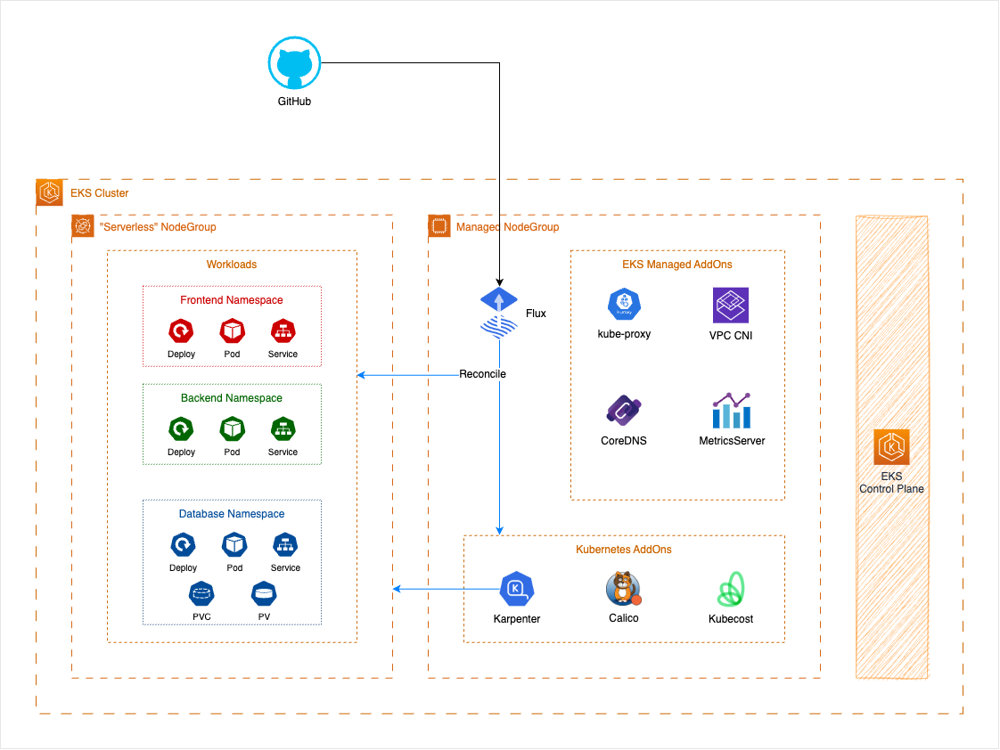

# EKS Cluster Upgrades Workshop


:bangbang: THIS WORKSHOP IS PERFORMING UPGRADES FROM VERSION `1.25` :bangbang:

This workshop covers best practices that are applicable for both older and newer versions of Kubernetes. We are committed to keeping our content up-to-date with the latest Amazon EKS releases, Let's get started!

[Click here to access the workshop](https://eks-upgrades-workshop.netlify.app/)

## Introduction

The Amazon cluster upgrades workshop is built to provide you with a reference architecture that can help make your Amazon EKS Cluster upgrades less painful and more seamless. To achieve this, we will be using a GitOps strategy with Fluxv2 for components reconciliation and Karpenter for Node Scaling.

### Why this architecture?

One of the key benefits of using GitOps is that it enables us to use a mono repository approach for deploying both add-ons and applications. This approach makes the upgrade process much smoother because we have a single location to look at for deprecated API versions and ensure that add-ons are backwards compatible.



By the end of this workshop, you will have a solid understanding of how to use GitOps with Fluxv2 and Karpenter to simplify the EKS Cluster upgrade process. We hope that this will help you to streamline your workflow and ensure that your infrastructure is always up-to-date and functioning smoothly. So, let's dive in and get started!


## Navigating the repository

The top level repository can be split is to several areas.

### Site content

The workshop content itself is a `docusaurus` site. All workshop content is written using Markdown and can be found in `website`.

### Learner environment

To spin -up your learn environment, go to [`website`](./website/README.md#local-development) page and follow the instructions to run your docussaurus website.

### Locally deploy with terraform:

**You will need to fork this repo.**

Once forked, execute the `install.sh` (located in the root of this repo) script and fill te asked questions:

```bash
bash ./install.sh
```

> When asked for `tf_state_path` leave it empty to provision all the components

After that you will need to uncomment lines `5` and `6` of `gitops/add-ons/kustomization.yaml` file

Then you can push the changes to your desired branch and flux will reconcile the changes

## Security

See [CONTRIBUTING](CONTRIBUTING.md#security-issue-notifications) for more information.

## License

This project is licensed under the Apache-2.0 License.


