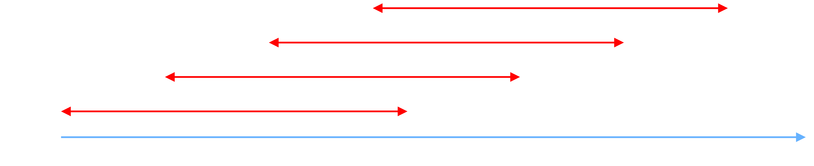
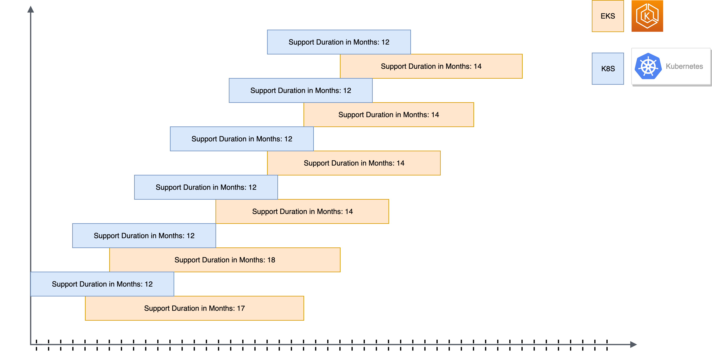

# Introduction

One of the key considerations for people who have chosen Amazon Elastic Kubernetes Service (EKS) as their container management platform is to plan for cluster upgrades. The Kubernetes project is constantly updating with new features, design updates, and bug fixes, and new minor versions are released on average every three months and are supported for about twelve months after their release.

## Kubernetes project release process

The Kubernetes project usually launches new minor versions on average every three months, and every version is supported for about twelve months after their release.

:::tip
Before adopting Kubernetes, be sure that you will have the commitment to stay up to date with the new platform versions.
:::

## Amazon EKS release process

Amazon EKS is typically some weeks behind the latest Kubernetes version, this is because before a new version of Kubernetes is made available on EKS, **it is thoroughly tested to ensure stability and compatibility with other AWS services and tools.**

:::note
Amazon EKS is committed to supporting at least four production-ready versions of Kubernetes. Whereas the Kubernetes project only supports the latest 3 versions.
:::

## About the workshop

The Amazon cluster upgrades workshop is built to provide you with a reference architecture that can help make your Amazon EKS Cluster upgrades **less painful and more seamless**. To achieve this, we will use a `GitOps` strategy with` Fluxv2` for components reconciliation and `Karpenter` for Node Scaling.

## Workshop architecture

One of the key benefits of using `GitOps` is that it enables us to use a `mono repository` approach for deploying both add-ons and applications. This approach makes the upgrade process much smoother because we have a single location to look at for deprecated API versions and ensure that add-ons are backwards compatible.

By the end of this workshop, you will have a solid understanding of how to use `GitOps with Fluxv2` and `Karpenter` to simplify the EKS Cluster upgrade process. We hope that this will help you streamline your workflow and ensure that your infrastructure is always up-to-date and functioning smoothly. So, let's dive in and get started!

