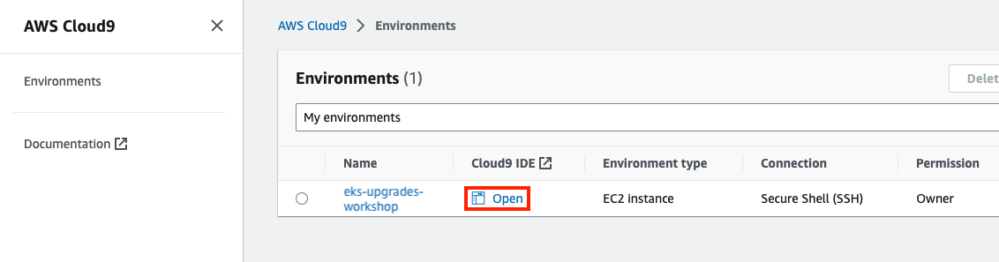

# Accessing the IDE

As part of the lab environment, you have access to an AWS Cloud9 IDE.

To access the Cloud9 IDE, log into your [AWS console](https://console.aws.amazon.com/) and search for Cloud9 in the menu bar at the top of the screen:


When the main Cloud9 screen opens, expand the menu on the left side of the screen:


There will be a Cloud9 environment named **eks-upgrades-workshop** available. Click the **Open** button to launch the IDE:



:::tip

If you do not see the eks-upgrades-workshop Cloud9 environment, this is because it is owned by another IAM user. Change the owner on Cloud9 Console.

:::

Once the IDE has loaded, we recommend you use the **+** button and select **New Terminal** to open a new full screen terminal window.


This will open a new tab with a fresh terminal.

:::info
You might see the following message: `An error occurred (AccessDeniedException) when calling the UpdateEnvironment operation: User: arn:aws:sts::xxxxxxxxxx:assumed-role/eks-upgrades-admin/i-xxxxxxxxxxx is not authorized to perform: cloud9:UpdateEnvironment on resource: xxxxxxxx with an explicit deny in an identity-based policy`

This is because we are disabling AWS temporary credentials. You can ignore it and move on
:::


You may also close the small terminal at the bottom if you wish.

Your IDE comes pre-configured to access the workshop EKS cluster and also provides a set of tools you will need, like the `aws` and `kubectl`, `pluto`, `eksctl`, `kubent` CLI tools.

```bash
kubectl version
pluto version
eksctl version
kubent version
aws --version
kubent --version
```

Along with the Cloud9 instance, this workshop already has provisioned for you all needed resources, including the Amazon EKS cluster. Check that by running the follow command.

```
kubectl get nodes
```

You should see the following output:

```output
NAME                                                 STATUS   ROLES    AGE   VERSION
fargate-ip-10-35-28-29.us-east-2.compute.internal    Ready    <none>   53m   v1.24.12-eks-f4dc2c0
fargate-ip-10-35-37-154.us-east-2.compute.internal   Ready    <none>   53m   v1.24.12-eks-f4dc2c0
fargate-ip-10-35-38-99.us-east-2.compute.internal    Ready    <none>   53m   v1.24.12-eks-f4dc2c0
fargate-ip-10-35-45-57.us-east-2.compute.internal    Ready    <none>   53m   v1.24.12-eks-f4dc2c0
```

<!-- For example, run the following command to get details about your EKS cluster: -->


<!-- TBD: Provision cluster -->
<!-- ```bash
$ aws eks describe-cluster --name $EKS_CLUSTER_NAME
{
    "cluster": {
        "name": "eks-upgrades-workshop",
        "arn": "arn:aws:eks:us-west-2:1234567890:cluster/eks-upgrades-workshop",
        "createdAt": 1662084731.367,
        "endpoint": "https://7C18D86993E776387BB6C040FBA9D359.sk1.us-west-2.eks.amazonaws.com",
[...]
}
```

You can also check that you can connect to your EKS cluster like so:

```bash
$ kubectl get nodes
NAME                                         STATUS   ROLES    AGE     VERSION
ip-10-42-10-176.us-west-2.compute.internal   Ready    <none>   18h     v1.23.9-eks-ba74326
ip-10-42-10-56.us-west-2.compute.internal    Ready    <none>   18h     v1.23.9-eks-ba74326
ip-10-42-11-123.us-west-2.compute.internal   Ready    <none>   18h     v1.23.9-eks-ba74326
``` -->