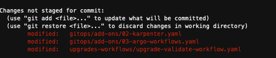

# Why GitOps?

One of the main customer challenges regarding EKS Cluster Upgrades is to make sure that your applications and add-ons don’t break compatibility with the newer EKS version. To help with this goal, we are going to use a GitOps strategy. GitOps works based on a SCM repository, where it becomes the only source of truth, and our GitOps controller, in this case FluxV2 will just mirror what we have declared into the repository.

## How a mono repo structure can benefit during EKS cluster upgrades?

As mentioned earlier, one of the major challenges that people face during cluster upgrades is compatibility. We need to validate our application’s manifests, making sure that we are not using anything removed from the API Server. So, using a mono repo strategy can help us on doing those validations easier. We can use tools such as kube-no-trouble and pluto to seek for those deprecated/removed apiVersions into a single place along with kubectl convertplugin that can help us to change those apiVersions in an automated way. Also, this repo structure helps us to identify our self-managed add-ons versions since all the add-ons that we are using are in a single place.


## Flux Reconciliation

Flux reconciliation is the process by which Flux continuously monitors a Git repository for changes to Kubernetes manifests and automatically applies them to a connected cluster. When a change is detected in the repository, Flux compares the updated manifest with the current state of the cluster. If there's a discrepancy, Flux updates the cluster to match the desired state defined in the Git repository. This GitOps-based approach ensures consistency, version control, and automation in managing Kubernetes deployments, streamlining CI/CD pipelines, and reducing human error.


## Enabling add-ons and understanding Flux reconciliation

In the previous module we have executed the `install.sh` script, it has installed flux into your cluster and also has cloned the forked repository. The script also has made some changes into some of our manifests. Let's apply it and see how flux reconciles those changes.

```bash
cd /home/ec2-user/environment/eks-cluster-upgrades-workshop && git status
```



As you can, see there are some unstaged files that we need to commit and push to our repo, those files are two add-ons that we are gonna be using during this workshop, `karpenter` and `argo-workflows`. Now let's uncomment lines `5` and `6` of add-ons `kustomization.yaml` (Kustomization object) file.

:::tip
In the context of Flux, a Kustomization object is a custom resource defined by the Kustomization CRD. Flux uses Kustomization resources to manage Kubernetes manifests, specifying the syncing interval, pruning resources, and validating manifests before applying them.
:::

```bash
sed -i 's/# //' /home/ec2-user/environment/eks-cluster-upgrades-workshop/gitops/add-ons/kustomization.yaml
```

Checking the manifest to make sure that we have to remove the comment from every line:

```bash
cat /home/ec2-user/environment/eks-cluster-upgrades-workshop/gitops/add-ons/kustomization.yaml
```

Your Kustomization manifest should look like this:

```yaml
apiVersion: kustomize.config.k8s.io/v1beta1
kind: Kustomization
resources:
  - 01-metric-server.yaml
  - 02-karpenter.yaml
  - 03-argo-workflows.yaml
```

:::tip
You can include more add-ons if you want
:::

Once you push those changes to the GitHub repository, flux will automatically apply and deploy both `karpenter` and `argo-workflows` using a Helm Chart. Let's push those changes:

```bash
cd /home/ec2-user/environment/eks-cluster-upgrades-workshop/
git add .
git commit -m "Added add-ons in kutomization file"
git push origin $GIT_BRANCH
```

:::tip
Keep your GitHub username and GitHub token handy. You will gonna need many times during this workshop.
:::

Flux will now detect the changes and start the reconciliation process. It does this by periodically polling the GitHub repository for changes. You can monitor the Flux logs to observe the reconciliation process:

```bash
kubectl -n flux-system get pod -o name | grep -i source | while read POD; do kubectl -n flux-system logs -f $POD --since=1m; done
```
You should see logs indicating that the new changes have been detected and applied to the cluster:

```json
{"level":"info","ts":"2023-06-05T17:01:03.995Z","msg":"stored artifact for commit 'Added add-ons in kutomization file'","controller":"gitrepository","controllerGroup":"source.toolkit.fluxcd.io","controllerKind":"GitRepository","GitRepository":{"name":"flux-system","namespace":"flux-system"},"namespace":"flux-system","name":"flux-system","reconcileID":"d594bbe0-1f6d-4364-8a3f-67daf56035db"}
```

Veryfing if `karpenter` and `argo-workflows` were installed successfully:

```bash
kubectl get helmreleases -nflux-system
```

You should see the following output:

```
NAME             AGE    READY   STATUS
argo-workflows   119s   True    Release reconciliation succeeded
karpenter        119s   True    Release reconciliation succeeded
metrics-server   32m    True    Release reconciliation succeeded
```
