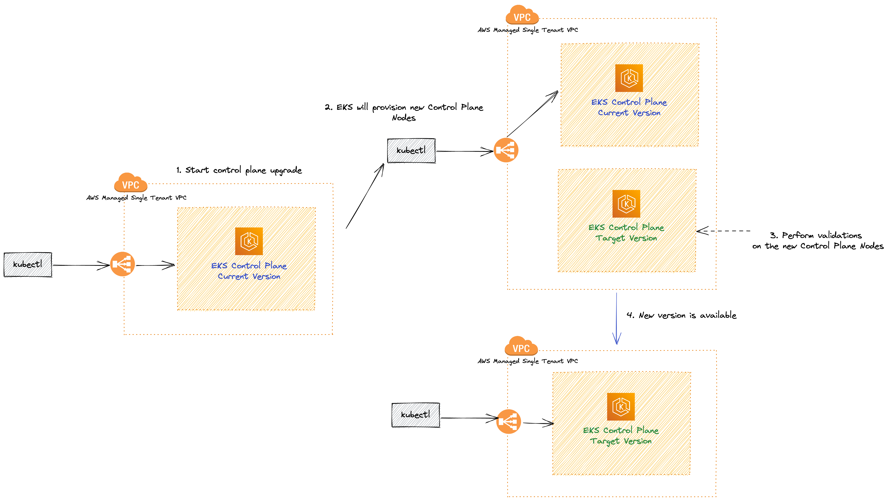

# Upgrading EKS

In this guide, we'll go through the process of upgrading your Amazon Elastic Kubernetes Service (EKS) cluster, which is essential for maintaining optimal performance, security, and availability.

We also will cover the importance of updates, how AWS manages EKS upgrades, and what happens when an upgrade fails. Finally, we will provide instructions on how to update the eksctl.yaml file in the helpers folder and apply the changes using the eksctl command.

## How AWS Manages EKS Upgrades

The EKS upgrade process is managed by AWS to ensure a seamless and safe transition between Kubernetes versions. Here is a detailed breakdown of the steps AWS takes to upgrade the EKS control plane:



1. **Pre-upgrade checks**: AWS first performs pre-upgrade checks, including assessing the current cluster state and evaluating the compatibility of the new version with your workloads. If any issues are detected, the upgrade process will not proceed.

2. **Backup and snapshot**: Before initiating the upgrade, AWS takes a backup of your existing control plane and creates a snapshot of your etcd data store. This is done to ensure data consistency and to enable rollback in case of an upgrade failure.

:::tip
For additional data protection, consider using [Velero](https://velero.io/), an open-source tool that simplifies the backup and recovery process for Kubernetes cluster resources and persistent volumes. Velero allows you to schedule and manage backups, as well as restore processes, providing an extra layer of safety for your data.
:::

3. **Creating a new control plane**: AWS creates a new control plane with the desired Kubernetes version. This new control plane runs in parallel with your existing control plane, ensuring minimal disruption to your workloads.

4. **Testing compatibility**: The new control plane is tested for compatibility with your workloads, including running automated tests to verify that your applications continue to function as expected.

:::tip
The goal is to minimize potential disruptions during the upgrade process and maintain the stability of your services. It's important to mention that this only looks for your application health and not for API's that may be removed or deprecated
:::

5. **Switching control plane endpoints**: Once compatibility is confirmed, AWS switches the control plane endpoints (API server) to the new control plane. This switch happens atomically, resulting in minimal downtime during the upgrade process.

6. **Terminating the old control plane**: The old control plane is terminated once the upgrade is complete, and all resources associated with it are cleaned up.

### EKS Rollback on Upgrade Failure


In case an EKS upgrade fails, AWS has measures in place to minimize disruption and revert the control plane to its previous version:

1. **Detecting the failure:** AWS constantly monitors the upgrade process to detect any issues. If a problem arises during the upgrade, the process is immediately halted.

2. **Restoring from backup:** AWS uses the backup and snapshot created before the upgrade to restore the control plane and etcd data store to their previous state.

3. **Switching control plane endpoints:** AWS atomically switches the control plane endpoints back to the previous control plane, ensuring minimal downtime.

4. **Terminating the new control plane:** Once the rollback is complete, AWS terminates the new control plane and cleans up any associated resources.

5. **Post-rollback assessment:** After the rollback, AWS will assess the reasons behind the upgrade failure and provide guidance on how to address the issues. You will need to troubleshoot and resolve the problems before attempting the upgrade again.

## Upgrading EKS Cluster

We have used terraform to spin-up our cluster, all the add-ons are managed via Flux and we already have done the validation of deprecated APIs and add-ons, let's apply the cluster upgrade to a newer version:

```bash
cd /home/ec2-user/environment/eks-cluster-upgrades-workshop/terraform/clusters

terraform plan -var="git_password=$GITHUB_TOKEN" -var="git_username=$GITHUB_USER" -var="git_url=https://github.com/$GITHUB_USER/eks-cluster-upgrades-workshop.git" -var="git_branch=$GIT_BRANCH" -var="aws_region=$AWS_REGION" -var="cluster_version=1.25"
```

As you can see we are defining the variable `cluster_version=1.25` forcing terraform to change the Control Plane to version `1.25`. Also since we are using EKS managed add-ons we can upgrade tham all together to the latest available version, see snippet below of the output of `terraform plan`:


```json
  # module.eks.time_sleep.this[0] must be replaced
    +/- resource "time_sleep" "this" {
      ~ id              = "2023-06-05T15:14:32Z" -> (known after apply)
      ~ triggers        = { # forces replacement
          ~ "cluster_version"                    = "1.24" -> "1.25"
            # (3 unchanged elements hidden)
        }
        # (1 unchanged attribute hidden)
    }

    ~ resource "aws_eks_addon" "before_compute" {
      ~ addon_version        = "v1.12.6-eksbuild.2" -> (known after apply)
        id                   = "eks-upgrades-workshop:vpc-cni"
        tags                 = {
            "Blueprint"              = "eks-upgrades-workshop"
            "GithubRepo"             = "github.com/aws-ia/terraform-aws-eks-blueprints"
            "karpenter.sh/discovery" = "eks-upgrades-workshop"
        }
        # (8 unchanged attributes hidden)

        # (1 unchanged block hidden)
    }

    # module.eks.aws_eks_addon.this["aws-ebs-csi-driver"] will be updated in-place
  ~ resource "aws_eks_addon" "this" {
      ~ addon_version     = "v1.19.0-eksbuild.1" -> (known after apply)
        id                = "eks-upgrades-workshop:aws-ebs-csi-driver"
        tags              = {
            "Blueprint"              = "eks-upgrades-workshop"
            "GithubRepo"             = "github.com/aws-ia/terraform-aws-eks-blueprints"
            "karpenter.sh/discovery" = "eks-upgrades-workshop"
        }
        # (7 unchanged attributes hidden)

        # (1 unchanged block hidden)
    }

    # module.eks.aws_eks_addon.this["coredns"] will be updated in-place
  ~ resource "aws_eks_addon" "this" {
      ~ addon_version        = "v1.9.3-eksbuild.3" -> (known after apply)
        id                   = "eks-upgrades-workshop:coredns"
        tags                 = {
            "Blueprint"              = "eks-upgrades-workshop"
            "GithubRepo"             = "github.com/aws-ia/terraform-aws-eks-blueprints"
            "karpenter.sh/discovery" = "eks-upgrades-workshop"
        }
        # (8 unchanged attributes hidden)

        # (1 unchanged block hidden)
    }

  # module.eks.aws_eks_addon.this["kube-proxy"] will be updated in-place
  ~ resource "aws_eks_addon" "this" {
      ~ addon_version     = "v1.24.10-eksbuild.2" -> (known after apply)
        id                = "eks-upgrades-workshop:kube-proxy"
        tags              = {
            "Blueprint"              = "eks-upgrades-workshop"
            "GithubRepo"             = "github.com/aws-ia/terraform-aws-eks-blueprints"
            "karpenter.sh/discovery" = "eks-upgrades-workshop"
        }
        # (7 unchanged attributes hidden)

        # (1 unchanged block hidden)
    }
```

As you can see, using terraform we are forcing all the `managed-add-ons` also to be upgraded to the latest available version, now let's apply the script.

```bash
terraform apply --auto-approve -var="git_password=$GITHUB_TOKEN" -var="git_username=$GITHUB_USER" -var="git_url=https://github.com/$GITHUB_USER/eks-cluster-upgrades-workshop.git" -var="git_branch=$GIT_BRANCH" -var="aws_region=$AWS_REGION" -var="cluster_version=1.25"
```

:::note
The upgrade process can take a while, might be a good time for a break!
:::

After it finished, let's validate that our cluster is really in the desired version by running the follow command:

```bash
kubectl version | grep -i server
```

The output should be similar to this:

```json
Server Version: version.Info{Major:"1", Minor:"25+", GitVersion:"v1.25.9-eks-0a21954", GitCommit:"eb82cd845d007ae98d215744675dcf7ff024a5a3", GitTreeState:"clean", BuildDate:"2023-04-15T00:37:59Z", GoVersion:"go1.19.8", Compiler:"gc", Platform:"linux/amd64"}
```

As you can see, the Server Version is now `1.25`

## Upgrading Nodes

In this workshop both `self-managed` and `managed` add-ons are hosted in Fargate micro-vms, it means that we don't need to worry about the upgrade of the things that are hosted using Fargate since it is a serverless way to run applications. But our `sample-app` is running in Nodes provisioned by Karpenter, so let's explore what challenges can be involved when upgrading Nodes, and how Karpenter will help us.

Karpenter by default will use `Amazon EKS optimized AMIs`, whenever Karpenter launches a new node, it will match the Control Plane version of that node. It means that after an upgrade process you don't need to upgrade all your Nodes at once, you can let Karpenter little by little replace nodes with old kubelet version, to new ones that matches EKS Control Plane version.

### Rollout Karpenter nodes

Getting the Node name that we will perform the drain:

```bash
kubectl get nodes -l node-type=applications
```

Output should look like this:

```bash
NAME                          STATUS   ROLES    AGE   VERSION
ip-192-168-6-9.ec2.internal   Ready    <none>   21h   v1.24.xx-eks-a59e1f0
```

Validate if all of our application pods are running in the same Node:

```bash
kubectl -n default get pods -o=custom-columns=NAME:.metadata.name,STATUS:.status.phase,NODE:.spec.nodeName
```

Output should look like this:

```
NAME                     STATUS    NODE
nginx-c5bfd7b85-9snbt   Running     ip-10-35-46-50.us-east-2.compute.internal
nginx-c5bfd7b85-g67lb   Running     ip-10-35-46-50.us-east-2.compute.internal
nginx-c5bfd7b85-swmvj   Running     ip-10-35-46-50.us-east-2.compute.internal
```

As you can see, all the 3 nginx replicas are running in the same node, let's start by using `kubectl cordon` to mark your old nodes as `unschedulable`:

```bash
kubectl cordon $(kubectl get nodes -l node-type=applications -oname)

kubectl get nodes -l node-type=applications
```

You should see an output similar to this:

```bash
NAME                          STATUS                     ROLES    AGE   VERSION
ip-192-168-6-9.ec2.internal   Ready,SchedulingDisabled   <none>   21h   v1.24.xx-eks-a59e1f0
```

`STATUS` will be SchedulingDisabled, because `kubectl cordon` command have applied a taint into this node to make sure new pods are not schedule in it.

Let's drain our Node, using `kubectl drain` to safely evict all of your pods from your old nodes to the new ones.

```bash
kubectl drain $(kubectl get nodes -l node-type=applications -oname) --ignore-daemonsets
```

The output should be similar to this.

```bash
node/ip-10-35-46-50.us-east-2.compute.internal already cordoned
Warning: ignoring DaemonSet-managed Pods: kube-system/aws-node-629pr, kube-system/ebs-csi-node-rfgzv, kube-system/kube-proxy-q2b56
evicting pod default/nginx-c5bfd7b85-swmvj
evicting pod default/nginx-c5bfd7b85-9snbt
evicting pod default/hello-28100160-4gwbq
evicting pod default/nginx-c5bfd7b85-g67lb
error when evicting pods/"nginx-c5bfd7b85-g67lb" -n "default" (will retry after 5s): Cannot evict pod as it would violate the pod's disruption budget.
error when evicting pods/"nginx-c5bfd7b85-swmvj" -n "default" (will retry after 5s): Cannot evict pod as it would violate the pod's disruption budget.
error when evicting pods/"nginx-c5bfd7b85-9snbt" -n "default" (will retry after 5s): Cannot evict pod as it would violate the pod's disruption budget.
pod/hello-28100160-4gwbq evicted
```

Ops! it seems that we have a too agressive `Pod Disruption Budget` let's fix that.

#### Adjusting PDBs (Pod Diruption Budgets)

Let's see how our PDB is configured now:

```bash
kubectl get pdb
```

As you can see we have the `MIN AVAILABLE` of 3, and we have only 3 replicas of our sample-app running, so this PDB is considered `TOO AGRESSIVE`, let's change that:

```bash
cat <<'EOF' > /home/ec2-user/environment/eks-cluster-upgrades-workshop/gitops/applications/01-pdb-sample-app.yaml
apiVersion: policy/v1
kind: PodDisruptionBudget
metadata:
  name: nginx-pdb
  namespace: default
spec:
  minAvailable: 1
  selector:
    matchLabels:
      app: nginx
EOF
```

We have changed the `minAvailable` from `3` to `1`, this will give us space to drain. Commit and push the changes to the repository:

```bash
cd /home/ec2-user/environment/eks-cluster-upgrades-workshop/
git add .
git commit -m "Changed PDB manifest from 3 to 1"
git push origin $GIT_BRANCH
```

Wait few seconds, and validate that Flux has applied the new PDB:

```bash
kubectl -n default get pdb/nginx-pdb -w
```

You should see the output similar to this:

```
NAME        MIN AVAILABLE   MAX UNAVAILABLE   ALLOWED DISRUPTIONS   AGE
nginx-pdb   1               N/A               2                     36m
```

As we can see we have changed the `MIN AVAILABLE` to `1` so now we can have `2` `ALLOWED DISRUPTIONS`.

:::note
This can change depending on each use case, remember to always configure PDBs based on your needs.
:::

### Rollout Karpenter nodes (Adjusted PDB)

Now, try to drain your node again:

```bash
kubectl drain $(kubectl get nodes -l node-type=applications -oname) --ignore-daemonsets
```

Since we are defining at least `1` replica available, `Karpenter` will deploy a new Node for us before terminating the old one to guarantee HA. After it finished let's see the new node that we have.

```bash
kubectl get nodes -l node-type=applications
```

You should see the following output:

```
NAME                                         STATUS   ROLES    AGE   VERSION
ip-10-35-10-230.us-east-2.compute.internal   Ready    <none>   69s   v1.25.xx-eks-0a21954
```

As you can see, we have two nodes managed by Karpenter, one that is being drained with version `1.24` and a new one with version `1.25`, Karpenter notice those pods that were evicted before and create a new node to handle those pods, let's verify again:

```bash
kubectl get nodes -l node-type=applications
kubectl -n default get pods -o=custom-columns=NAME:.metadata.name,STATUS:.status.phase,NODE:.spec.nodeName
```

You should now be able to see only a single Node managed by Karpenter, and all pods running in this new Node.