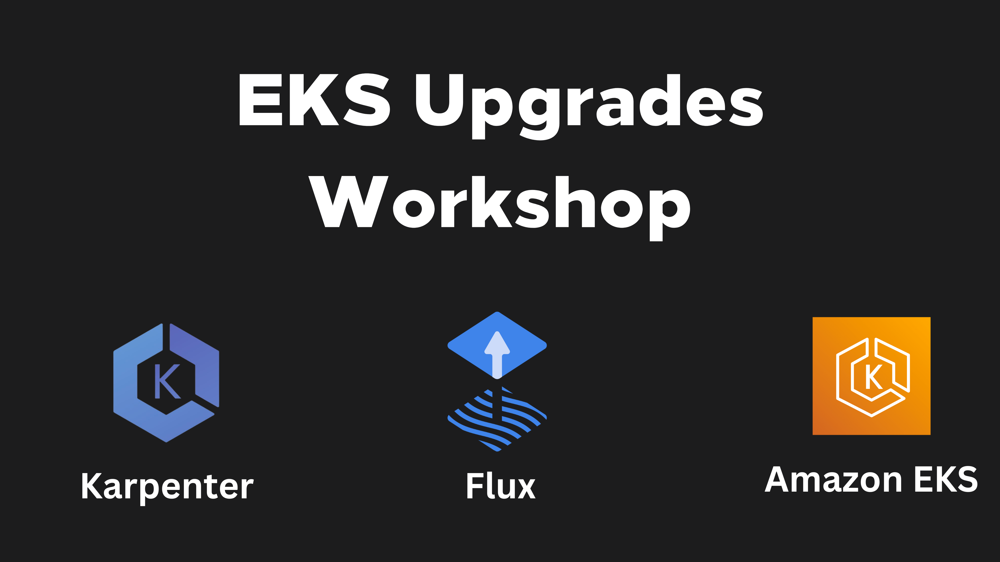

:::tip
This workshop is performing upgrades from version `1.23`
:::

:::note
This workshop covers best practices that are applicable for both older and newer versions of Kubernetes. We are committed to keeping our content up-to-date with the latest Amazon EKS releases, Let's get started!
:::

