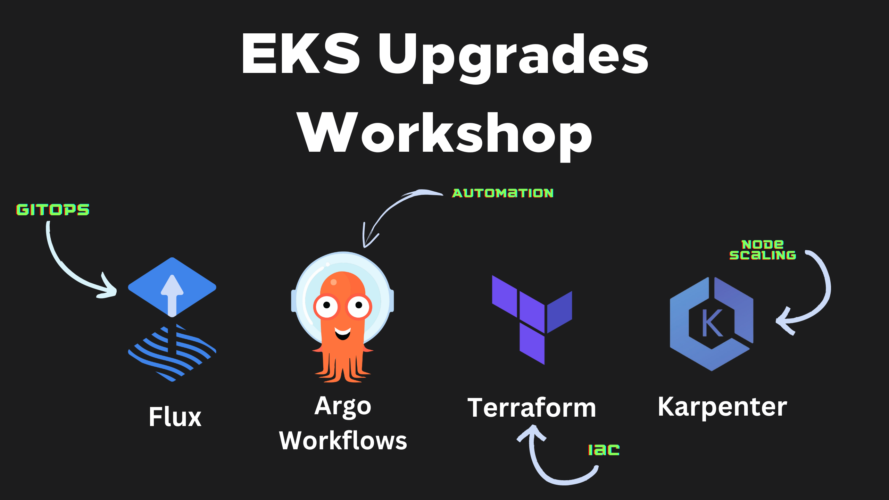

:::info
This workshop is performing upgrades from version `1.24`
:::

# About the workshop

The Amazon EKS cluster upgrades workshop is built to provide you with a reference architecture that can help make your Amazon EKS Cluster upgrades **less painful and more seamless**. To achieve this, we have used a `GitOps` strategy with `Fluxv2` for components reconciliation (all add-ons and apps are managed by flux), `Karpenter` for Node Scaling along with `AWS Fargate` for hosting the addons, and `Argo Workflows` to validate what has to be changed before running the upgrade.

:::info
**Workshop expected duration:** 1,5 hours
:::

